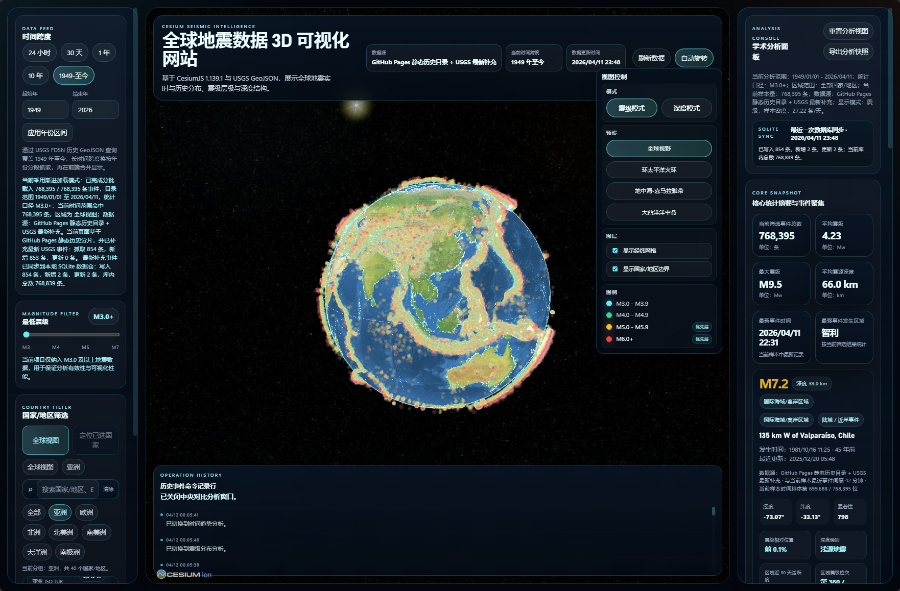
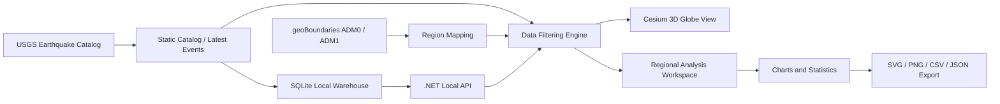

<div align="center">

# Global Earthquake

**Global 3D Earthquake Visualization and Analysis System Based on CesiumJS**

面向全球地震活动展示、区域比较分析、教学演示、科研汇报与 GitHub Pages 在线发布的三维可视化平台。

<p>
  
  
  
  
</p>

</div>



## Overview

**Global Earthquake** 是一个基于 **CesiumJS** 构建的全球地震三维可视化与分析系统。项目以全球尺度、长时间跨度和区域对比分析为核心，在三维地球场景中高密度呈现历史地震与最新事件，并围绕筛选后的事件集提供适用于 **课程答辩、科研汇报、论文附图、教学演示与在线展示** 的分析能力。

它不只是一个“把点绘制在地球上”的演示页面，而是将 **空间浏览、时间筛选、区域识别、统计分析、图表导出与静态部署** 整合为一体的完整工作流。

## Highlights

- 基于 **CesiumJS 1.139.1** 的全球三维地球地震可视化
- 支持 **1949 年至今** 的历史地震目录浏览
- 支持 **历史静态目录 + 最新 USGS 事件** 的混合加载
- 基于 **geoBoundaries ADM0 / ADM1** 的国家与子区域识别
- 支持 **全中文国家 / 地区筛选与多区域对比分析**
- 集成多类统计图表与 **SVG / PNG / CSV / JSON** 导出能力
- 支持 **GitHub Pages 静态部署** 与 **本地 SQLite 数据仓模式** 双运行体系

## Features

### 1. 3D Globe Visualization

- 基于 `CesiumJS 1.139.1` 构建三维地球主场景
- 支持两种核心视觉编码：
  - **Magnitude Mode**：按震级着色与抬升
  - **Depth Mode**：按深度着色与抬升
- 支持自动旋转与自由视角浏览
- 支持经纬网、国家边界、地区边界图层控制
- 支持多个典型地震带相机预设：
  - 全球视角
  - 环太平洋火环
  - 地中海-喜马拉雅地震带
  - 大西洋洋中脊

### 2. Temporal and Magnitude Filtering

- 内置多种时间窗口：
  - `24 小时`
  - `30 天`
  - `1 年`
  - `10 年`
  - `1949 年至今`
- 支持自定义起止年份
- 支持最低震级阈值筛选
- 默认聚焦 `M3.0+` 事件，以兼顾分析价值与渲染性能

### 3. Country and Region Selection

- 基于 `geoBoundaries ADM0 / ADM1` 实现国家与子区域划分
- 支持全中文国家/地区名称展示
- 支持中文、英文与 ISO 代码搜索
- 支持按洲浏览与国家聚焦
- 支持单国家视角下的子区域分析

### 4. Regional Comparison Workspace

- 支持按以下指标对地区进行排序：
  - 事件总数
  - 平均震级
  - 最大震级
  - 平均深度
- 支持将多个国家 / 地区 / 子区域加入对比集合
- 支持批量选择与一键清空
- 所有分析模块均由选区集合驱动，实现统一分析入口

### 5. Analytical Dashboard

当前版本提供以下分析模块：

- 事件总数对比
- 平均震级对比
- 最大震级对比
- 平均深度对比
- 时间趋势对比
- 震级分布对比
- 深度结构对比
- 能量释放对比

适用的典型分析方式包括：

- **单地区分析**
- **多地区横向比较**
- **中央弹窗深度分析与导出**

### 6. Export for Presentation and Research

- 中央分析窗口支持导出：
  - `SVG`
  - `PNG`
  - `CSV`
  - `JSON`
- 右侧控制台支持导出当前分析快照
- 导出结果适用于：
  - PPT 与课程答辩
  - 学术汇报
  - 论文附图与补充材料
  - 教学演示

### 7. Dual Runtime Modes

| 模式 | 数据来源 | 是否需要后端 | 适用场景 |
| --- | --- | --- | --- |
| GitHub Pages 静态模式 | `data/catalog` + `data/geoboundaries` + USGS 最新事件前端补充 | 否 | 在线展示、公开部署 |
| 本地服务模式 | SQLite + 本地 API + 静态数据 + USGS 同步 | 是 | 本地分析、数据维护、目录更新 |

本地服务模式支持：

- SQLite 历史目录查询
- 全量历史目录同步
- 最新事件增量写入
- 静态目录导出
- 同步状态追踪

## Architecture



### Core Workflow

1. 从 **USGS** 获取历史目录与最新事件数据
2. 使用 **geoBoundaries** 建立国家 / 地区 / 子区域边界映射
3. 在前端完成时间、震级、区域与视觉编码筛选
4. 将筛选结果同步驱动三维地球展示与统计分析模块
5. 将分析结果导出为适合汇报与研究的图表和数据文件

## Interface Overview

### Left Control Panel

- 时间跨度控制
- 最低震级控制
- 国家 / 地区筛选
- 视觉编码切换
- 三维抬升模式切换
- 相机预设
- 图层控制与图例显示

### Central 3D View

- 三维地球主视图
- 顶部数据概览栏
- 操作历史记录面板
- 最新状态与同步反馈

### Right Analysis Panel

- 学术分析控制台
- SQLite 同步状态摘要
- 核心统计快照
- 最新 / 最强事件摘要
- 区域控制中心
- 比较分析工作台
- 中央弹窗导出入口

## Tech Stack

- `CesiumJS 1.139.1`
- `HTML / CSS / JavaScript`
- `.NET`
- `SQLite`
- `PowerShell`
- `Python`

## Data Sources

- `USGS Earthquake Catalog / GeoJSON`
- `geoBoundaries` 全球行政边界数据
- 本地静态历史目录 `data/catalog`
- 本地边界目录 `data/geoboundaries`

## Quick Start

### Option 1: Preview Static Frontend

适合验证前端页面、静态资源与 GitHub Pages 产物。

```powershell
.\serve.ps1
```

默认访问地址：

```text
http://127.0.0.1:8123
```

### Option 2: Run Full Local Service Mode

适合进行 SQLite 同步、目录维护与完整联调。

```powershell
.\start-localserver.ps1
```

该模式将自动完成：

- 编译 `.localserver`
- 启动本地 API
- 提供静态页面服务
- 连接本地 SQLite 数据仓

## GitHub Pages Deployment

项目已适配 **GitHub Pages** 静态部署。Pages 模式下不会启动本地 `.NET` 服务，而是直接读取仓库中的静态数据与资源文件。

### Published Content

- `index.html`
- `app.js`
- `styles.css`
- `Cesium-1.139.1/Build/Cesium`
- `data/catalog`
- `data/geoboundaries`
- `.nojekyll`

### Build Static Package

```powershell
.\scripts\build-pages-package.ps1 -OutputDir _site
```

### Enable Pages

1. 打开仓库 `Settings -> Pages`
2. 将 `Source` 设置为 `GitHub Actions`
3. 推送到默认分支，或手动运行 Pages 工作流

## Data Maintenance

### Export Static Historical Catalog

```powershell
dotnet run --project .\.localserver\StaticServer.csproj -- --export-static-catalog --output=.\data\catalog
```

### Rebuild geoBoundaries Dataset

```powershell
py .\scripts\build_geoboundaries_data.py
```

该脚本用于整理本地 `ADM0 / ADM1` 边界、名称映射与清洗后的行政区数据。

## Project Structure

```text
.
├─ index.html                     # 主页面结构
├─ app.js                         # 核心交互、渲染、分析与导出逻辑
├─ styles.css                     # 页面样式与分析系统样式
├─ data/
│  ├─ catalog/                    # 静态历史地震目录分批数据
│  └─ geoboundaries/              # ADM0 / ADM1 边界数据与清单
├─ .localserver/                  # 本地 .NET + SQLite 服务
├─ scripts/
│  ├─ build-pages-package.ps1     # GitHub Pages 打包脚本
│  └─ build_geoboundaries_data.py # 边界数据处理脚本
├─ Cesium-1.139.1/                # Cesium 运行时
└─ docs/images/                   # README 配图等文档资源
```

## Use Cases

- 全球地震活动时空分布展示
- 国家 / 地区尺度灾害对比分析
- 大数据可视化课程项目展示
- 教学课程演示与答辩
- 学术汇报配图与数据导出
- GitHub Pages 在线可视化项目主页

## Current Strengths

- 可直接浏览 **1949 年至今** 的全球地震历史目录
- 区域筛选系统已切换至本地 `geoBoundaries` 数据链路
- 国家与地区名称已统一接入中文展示体系
- 分析系统已从信息卡片升级为可导出图表的分析工作台
- 同时具备静态部署与本地数据仓双模式运行能力

## Roadmap

- 更丰富的专题分析模块
- 更强的导出模板与批量导出能力
- 时间动画回放
- 板块边界与构造背景图层
- 更细粒度的地区统计与专题报告生成
- 面向研究级使用场景的专题分析流程增强

## Acknowledgements

- USGS Earthquake Catalog
- geoBoundaries
- CesiumJS
